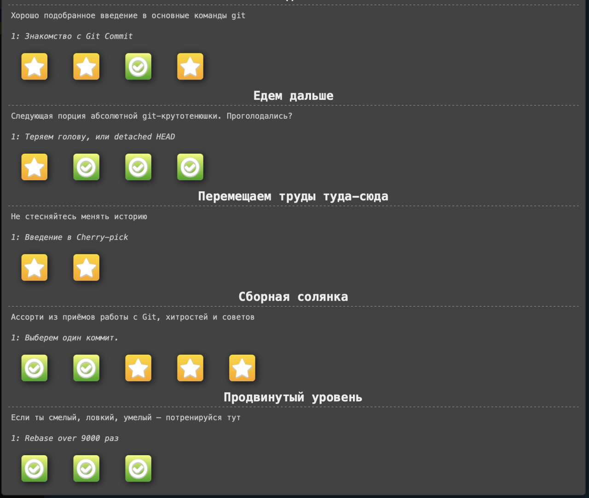
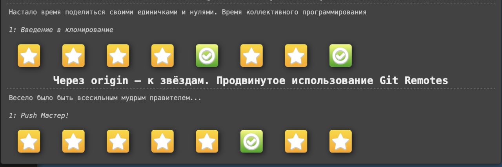

# Задание 0. Git

## Формулировка задания

1. Пройдите задания на работу с локальным репозиторием: https://learngitbranching.js.org [x]

2. Пройдите задания на работу с удалённым репозиторием: https://learngitbranching.js.org [x]

## Отчет по заданию

### Список проделанных действий

- Выполнил все задания на работу с локальным репозиторием (1).

- Выполнил все задания на работу с удалённым репозиторием (2).

