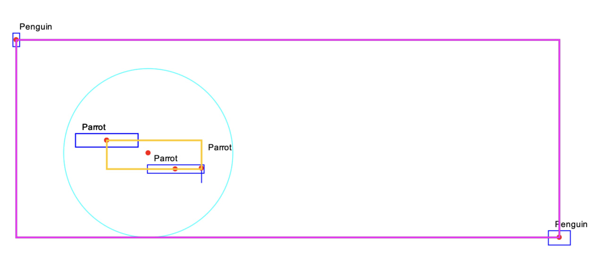
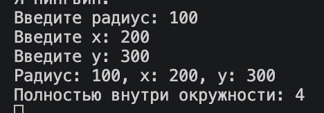
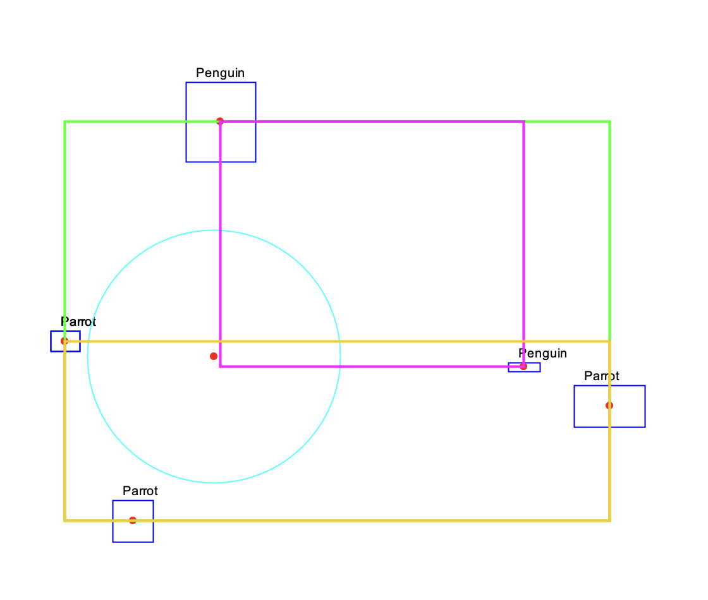

# Задание 6. Модификация Bird

## Формулировка задания
Модифицируйте исходный код проекта Birds:
[Исходный код задания](../sources/2_1_src/)

1. Реализуйте класс Sparrow, описывающий воробьёв. [x]

2. Исключите из класса BirdFlock атрибут birds. Вместо этого сделайте класс BirdFlock
выведенным из класса ArrayList<Bird>. [x]

3. Программа должна выводить количество попавших в заданную окружность птиц.
Параметры окружности (координаты центра и радиус) должны вводиться с
клавиатуры (запрашиваться у пользователя). [x]

4. Все изображаемые птицы должны очерчиваться минимальным прямоугольником.
Рамка должна проводиться через центры крайних птиц. [x]

5. Все изображаемые птицы одного вида должны очерчиваться отдельным минимальным
прямоугольником. [x]

## Отчет по заданию

### Список проделанных действий

- Реализовал класс Sparrow (1).

- Произвел наследование класса ArrayList<Bird> в классе BirdFlock (2).

- Написал утилиту для удобного ввода информации с валидацией (shelldev.utils.valid_input).

- Написал маленькую утилиту для удобной работы с отрисовкой на базе Swing и AWT (shelldev.utils.paint).

- Написал интерфейсы для удобной работы (IPositionable, IRandomable, ISizable).

- Написал Классы BoundingBox и CircleBrawable для выполнения задания.

- Сделал подсчет птиц внутри окружности через метод isFullyInsideCircle в классе Bird (3).

- Написал функцию computeBoundingBox в классе Main для просчета минимального прямоугольника (4).

- Используя вышесказанную функцию computeBoundingBox и сортировку Bird по видам выполнил задания (5).

