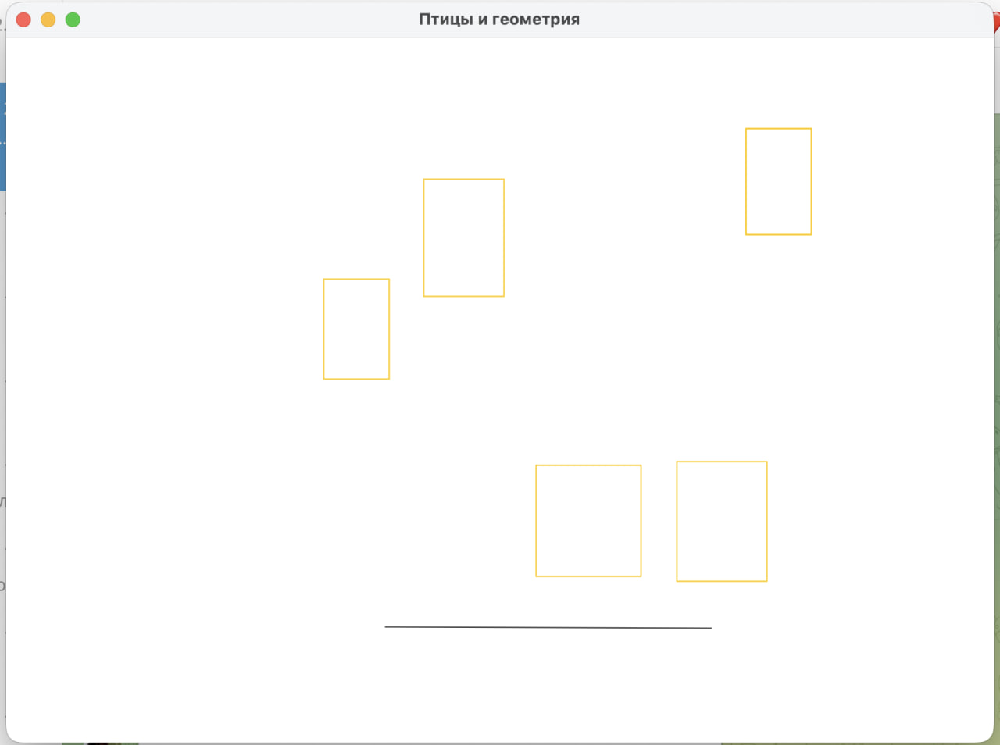
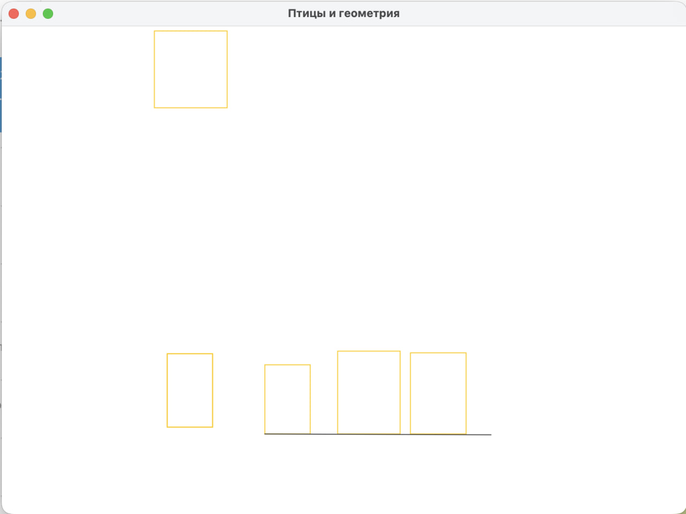

# Задание 7. Модификация Bird

## Формулировка задания
Модифицируйте исходный код проекта Birds:
[Исходный код задания](../sources/2_1_src/)

1. Реализуйте класс Point, описывающий точку на плоскости. Исключите из всех классов
атрибуты x и y. Вместо них используйте объекты класса Point. [x]

2. Теперь частью Сцены является и Ветка. Выглядит как отрезок, координаты концов
случайные. Запускаем программу — видим Коллектив птиц и ветку. Из консоли даем
команду птицам рассесться на ветке. Окно перерисовывается [через метод repaint()] —
видим птиц на ветке. Места на ветке всем может не хватить. Кто не сел на ветку,
может оказаться где угодно на Сцене. Количество мест «крепления» птиц на ветке
можно предрассчитать [зависит от размера ветки и максимального размера птицы].
Они могут быть распределены равномерно [как сейчас на скамейках автобусных
остановок делают]. [x]

## Отчет по заданию

### Список проделанных действий

- Сделал рефакторинг структуры кода, чтобы было по стандарту (com.разработчик.проект.).

- Написал класс Point (com.shelldev.project.math.Point) (1).

- Реализовал ESC подход (Entity, System, Component).

- Написал минимальный набор команд для удобного пользования.

- Добавил команду "stick" - второе задание (2).

