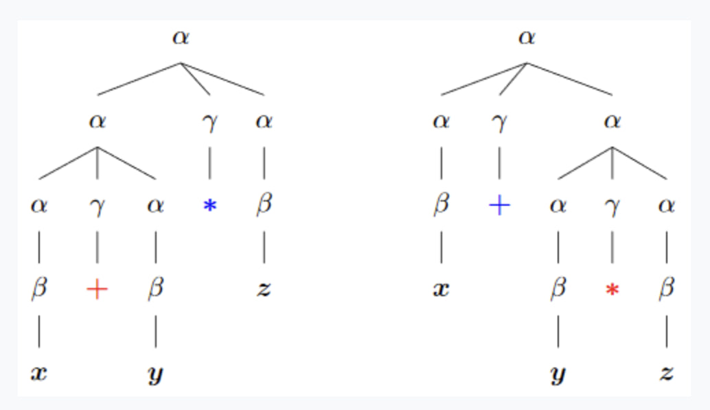
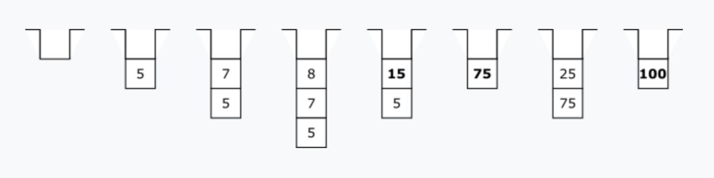

# ГРАММАТИКА

Язык правильных арифметических формул включает строки, содержащие произвольное число пар вложенных скобок, поэтому составить подходящее для задания этого языка регулярное выражение не удастся.

Контекстно-свободной грамматикой 𝐺 называется набор (Σ,𝑁,𝑃,𝑆), где:

Σ – множество символов алфавита формального языка;
𝑁 – множество метасимволов такое, что 𝑁∩Σ=∅;
𝑃 – множество правил вывода (строк) вида: 𝛼→𝛽, где 𝛼∈𝑁, а 𝛽∈(𝑁∪Σ)∗, причем для каждого 𝛼 встречается хотя бы одно правило с 𝛼 в левой части;
𝑆∈𝑁 – стартовый метасимвол.
Каждое правило грамматики имеет смысл подстановки. Например, строка 𝛼→𝛼𝛾𝛼 означает возможность замены метасимвола 𝛼 на цепочку 𝛼𝛾𝛼. Начав со стартового символа и пользуясь различными правилами грамматики, можно получать различные выводимые цепочки символов.

Если в цепочке встречается метасимвол, то ее можно преобразовать дальше, применив одно из правил грамматики с этим метасимволом в левой части. Если же метасимволов в цепочке не осталось, то процесс ее преобразования закончен и больше с цепочкой ничего сделать нельзя. Поэтому обычные символы из алфавита Σ часто называют терминалами, а вспомогательные метасимволы из 𝑁 – нетерминалами.

Языком 𝐿(𝐺), порожденным грамматикой 𝐺, называется множество всех терминальных выводимых цепочек. Правила грамматики не допускают вывода (генерации) строк, не принадлежащих языку.

Для задания грамматики часто используют очень наглядную форму представления, называемую нормальной формой Бэкуса-Наура (НФБН). Набор правил 𝑃 задают при этом в виде совокупности правил, перечисляющими все возможные цепочки, на которые может быть заменен каждый из метасимволов грамматики в процессе вывода, а стартовым метасимволом считается тот, который присутствует в левой части самого первого правила.


## ЯЗЫК ПРАВИЛЬНЫХ АРИФМЕТИЧЕСКИХ ФОРМУЛ

Опишем язык правильных арифметических формул. Ограничимся случаем, когда в формулах фигурируют только односимвольные переменные, запрещено использование унарных операций, а символ ∗, обозначающий умножение, не может быть опущен. В качестве алфавита Σ возьмем множество, состоящее из двух круглых скобок (открывающей и закрывающей), четырех знаков арифметических операций (+, −, ∗ и /) и 26-и идентификаторов от 𝑎 до 𝑧, которыми будут обозначаться произвольные целые числа: Σ={(,),+,−,∗,/,𝑎,𝑏,...,𝑧}. В качестве метаалфавита рассмотрим множество из трех нетерминалов: 𝑁={𝛼,𝛽,𝛾}, где символ 𝛼 будет обозначать формулу (или подформулу), 𝛽 – имя переменной, а 𝛾 – арифметическую операцию. Зададим множество правил грамматики 𝐺1 (33 правила):
𝛼→(𝛼)|𝛽|𝛼𝛾𝛼𝛽→𝑎|𝑏|...|𝑧𝛾→+|−|∗|/
Стартовым метасимволом является нетерминал 𝛼. Пример вывода формулы 𝑥+𝑦 (проверка строки на принадлежность языку): 𝛼→𝛼𝛾𝛼→𝛽𝛾𝛼→𝑥𝛾𝛼→𝑥+𝛼→𝑥+𝛽→𝑥+𝑦. Формулу 𝑥+𝑦∗𝑧 можно вывести двумя способами, каждому из которых соответствует свое дерево вывода:



Отличие состоит в порядке появления в формуле операций + и ∗. В одном случае выражение 𝑥+𝑦∗𝑧 трактуется как (𝑥+𝑦)∗𝑧, а в другом – как 𝑥+(𝑦∗𝑧). Грамматика 𝐺1 не отражает старшинства (приоритетов) операций. Тот же самый язык может быть задан с помощью грамматики 𝐺2 с правилами:
𝐹→𝑇|𝑇+𝐹|𝑇−𝐹𝑇→𝑀|𝑀∗𝑇|𝑀/𝑇𝑀→(𝐹)|𝑉𝑉→𝑎|𝑏|...|𝑧
Множество нетерминалов для этой грамматики состоит из четырех метасимволов – 𝐹, 𝑇, 𝑀 и 𝑉, обозначающих соответственно формулу, терм, множитель и имя переменной. Грамматика 𝐺2 верно отражает приоритеты арифметических операций, но неявно считает их все правоассоциативными, в то время как на самом деле они являются левоассоциативными. Постройте дерево разбора для формулы 𝑎+𝑏+𝑐: приоритет второй операции + будет выше приоритета первой. Зачастую язык правильных арифметических формул задается грамматикой 𝐺0:
𝐹→𝑇|𝐹+𝑇|𝐹−𝑇𝑇→𝑀|𝑇∗𝑀|𝑇/𝑀𝑀→(𝐹)|𝑉𝑉→𝑎|𝑏|...|𝑧
От грамматики 𝐺2 она отличается только порядком следования нетерминалов в правой части первых двух правил. Грамматика 𝐺3 – еще один способ задать язык правильных арифметических формул. Множество ее правил:
𝐹→𝑇{+𝑇}|𝑇{−𝑇}𝑇→𝑀{∗𝑀}|𝑀{/𝑀}𝑀→(𝐹)|𝑉𝑉→𝑎|𝑏|...|𝑧
Фигурные скобки в этой записи означают повторение стоящего в них фрагмента нуль или более раз. Таким образом, первое правило этой грамматики означает, что метасимвол 𝐹 может быть преобразован в 𝑇, 𝑇+𝑇, 𝑇−𝑇, 𝑇+𝑇+𝑇, 𝑇+𝑇−𝑇, 𝑇−𝑇+𝑇, 𝑇−𝑇−𝑇 и т.д.


## ЯЗЫК ПРОГРАММ СТЕКОВОГО КАЛЬКУЛЯТОРА

Стековый калькулятор – это программа, вычисляющая значение поданного на вход правильного арифметического выражения: для хранения данных и операций используются два стека.

Стековый калькулятор можно использовать для вычисления значений различных арифметических выражений. Например: 5(7+8)+25. Нужно только предварительно написать для этого программу.

Стековый калькулятор можно описать классом, реализующим следующий интерфейс: 

```java
interface StackCalc {
    //Добавить число в стек.
    void push(int val);

    //Показать вершину стека.
    int top() throws Exception;

    //Сложить.
    int add() throws Exception;

    //Вычесть.
    int sub() throws Exception;

    //Умножить.
    int mul() throws Exception;

    //Разделить.
    int div() throws Exception;
}
```

Семантика методов 𝚊𝚍𝚍, 𝚜𝚞𝚋, 𝚖𝚞𝚕 и 𝚍𝚒𝚟 такова: из стека извлекаются (с помощью метода 𝚙𝚘𝚙) два верхних числа, над ними выполняется указанная в названии метода арифметическая операция, а результат кладется обратно в стек (с помощью метода 𝚙𝚞𝚜𝚑). При этом в качестве первого аргумента арифметической операции берется тот из двух извлеченных элементов, который был положен в стек раньше другого. Если в момент вызова одного из этих четырех методов глубина стека меньше двух, возникает исключительная ситуация. При реализации данного интерфейса на базе ограниченного вектора выполнение метода 𝚙𝚞𝚜𝚑 также может привести к исключительной ситуации, связанной с переполнением стека.
С целью сокращения длины подобной программы будем записывать последовательность вызываемых методов в строку, разделяя их просто пробелом. Названия методов арифметических операций заменим на соответствующие им знаки действий (+, −, ∗ и /), вместо вызова метода 𝚙𝚞𝚜𝚑 с аргументом 𝚟𝚊𝚕 будем записывать только его аргумент, а завершающий любую программу вызов метода 𝚝𝚘𝚙 вообще включать в такую сокращенную запись программы не будем.

С использованием этих сокращений программа для вычисления выражения 5∗(7+8)+25 примет вид 578+∗25+. Последовательность состояний стека данных при выполнении этой программы:



Возьмем в качестве алфавита Σ множество, состоящее из четырех знаков арифметических операций (+, −, ∗ и /) и 26-и идентификаторов от 𝑎 до 𝑧, которыми будут обозначаться произвольные целые числа:

Σ={+,−,∗,/,𝑎,𝑏,...,𝑧}.

Тогда язык Σ∗ будет представлять из себя все возможные программы для стекового калькулятора, включая и неправильные.

Для описания языка правильных программ для стекового калькулятора будем использовать грамматику 𝐺𝑆:

𝑒→𝑒𝑒−|𝑒𝑒+|𝑒𝑒∗|𝑒𝑒/|𝑎|𝑏|...|𝑧.

Пример вывода программы для калькулятора:

𝑒→𝑒𝑒+→𝑒𝑒∗𝑒+→𝑒𝑒𝑒+∗𝑒+→→𝑎𝑒𝑒+∗𝑒+→𝑎𝑏𝑒+∗𝑒+→𝑎𝑏𝑐+∗𝑒+→𝑎𝑏𝑐+∗𝑑+


## ПОСТАНОВКА ЗАДАЧИ

Реализовать компилятор формул для стекового калькулятора, т.е. программу, осуществляющую автоматический перевод с сохранением семантики строки с языка правильных арифметических формул 𝐿(𝐺2) на язык программ стекового калькулятора 𝐿(𝐺𝑆).

Замечание: компиляции (и интерпретации) строк, как правило, предшествуют лексический и синтаксический анализ. Соглашение: в настоящем проекте на вход поступают строки, уже проверенные на правильность другими программами.


## ЛИСТИНГ КОДА

```java
//RecursCompf.java

//Рекурсивный компилятор формул.
public class RecursCompf{
    private static final int DEFSIZE = 256;
    private char[] str;
    private int index; //Число обработанных символов.

    public RecursCompf(){
        str = new char[DEFSIZE];
    }

    private void compileF(){
        compileT();

        if(index >= str.length)
            return;

        if(str[index] == '+'){
            index++;
            compileF();
            System.out.print("+");
            return;
        }

        if(str[index] == '-'){
            index++;
            compileF();
            System.out.print("-");
        }
    }

    private void compileT(){
        compileM();

        if(index >= str.length)
            return;

        if(str[index] == '*'){
            index++;
            compileT();
            System.out.print("*");
            return;
        }

        if(str[index] == '/'){
            index++;
            compileT();
            System.out.print("/");
        }
    }

    private void compileM(){
        if(str[index] == '('){
            index++;
            compileF();
            index++;
        }
        else
            compileV();
    }

    private void compileV(){
        System.out.print("" + str[index++] + " ");
    }

    public void compile(char[] str){
        this.str = str;
        index = 0;
        compileF();
        System.out.print("\n");
    }
}
```

```java
//RecursCompfTest.java
import java.util.Scanner;

//Тест для рекурсивного компилятора формул.
public class RecursCompfTest{
    public static void main(String[] args) throws Exception{
        RecursCompf c = new RecursCompf();

        Scanner in = new Scanner(System.in);
        while(true){
            System.out.print("Введите формулу -> ");
            c.compile(in.next().toCharArray());
        }
    }
}
```

Перед каждым вывозом одного из рекурсивных методов – 𝚌𝚘𝚖𝚙𝚒𝚕𝚎𝙵 и 𝚌𝚘𝚖𝚙𝚒𝚕𝚎𝚃 – обработанная часть формулы увеличивается (возрастает значение переменной 𝚒𝚗𝚍𝚎𝚡), что, в силу конечности длины исходной формулы,  гарантирует завершение работы программы.

УПРАЖНЕНИЕ

Запустите программу в режиме отладки и введите выражения 𝑎+𝑏, 𝑎+𝑏∗𝑐 и 𝑎+(𝑏+𝑐).