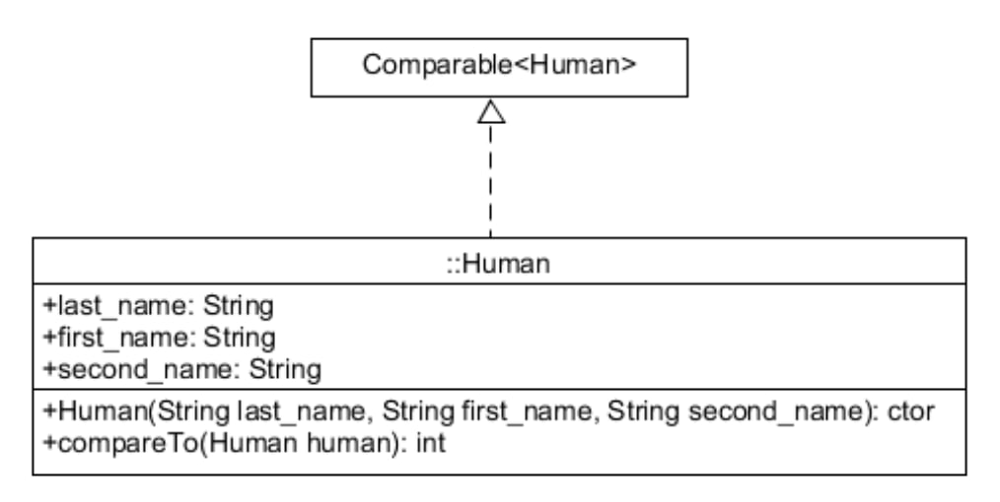

# Задание 13. Сравнение элементов контейнеров

## Формулировка задания

Согласно схеме, реализуйте класс Human, описывающий человека (фамилия, имя, отчество):



Через реализацию интерфейса Comparable<Human> «научите» его сравнивать два объекта
класса Human: 0– равны, >0– первый объект больше второго, <0– первый объект меньше
второго. Считайте, что человек «больше второго», если у него меньше (по алфавиту) ФИО и
больше возраст. Создайте в классе Main двусвязный список people из объектов класса Human
и отсортируйте его в лексографическом порядке с помощью java.util.Collections:

```java
Collections.sort(people);
System.out.println(people);
```

1 Работа над решением должна сопровождаться полноценным ведением локального
репозитория и дополняться покрывающими тестами.

## Отчет по заданию

### Список проделанных действий
